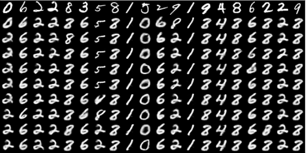

Title: Deep Learning Module in MLpack(Week 4)
Date: 2017-06-30 23:00:00
Tags: neural networks, restricted boltzmann machines
Author: Kris Singh

### Week Four
This week we mainly put finishing touches upon out existing Binary RBM PR. The finishing touches took time mainly because we were not able to train to the RBM correctly and one disastrous commit that I submitted that actually rolled back the changes that I had made earlier :(. 
 
We did a lot of trial and error's(mainly with the gibbs sampling step) to make it finally work. I do now undertand why people in Deep Learning talk so much about how hard it is to train DL models.
 
#### **Here are is our Result on the mnist Dataset**

 The samples are generated from *1000 steps gibbs sampling*

#### This is image is generated from deeplearnin.net example

We also added another test which basically a classification test using the latent learnt representation of mnist dataset. We compared our results with sci-kit learn framework. And we were able to get better accuracy than them on the subset of test cases. Though I think it would be a fair comparison if we do a 10-fold cross validation.
Right now the test size - 100 and train size 2500 our implementation classification accuracy is around 90% while sklearn is around 78% only(sklearn implementation the number of steps gibbs=1).
We have also added a serialization test to out implementation this week.

I think the PR would be accepted this week(fingers crossed).

I have also started working on the ssRBM. It was disappointing to see that no other libraries have actually implemented the ssRBM so we could compare our results with them. Even the authors do not provide a link to the code. Anyways, I have implemented the spike-slab layer(hidden) layer and visible layer for the ssRBM and would be opening a PR by this weekend.

The main goals for next week are the following
1. Implement ssRBM
2. Start writing tests for ssRBM.

*PS. I would like to thank Mikhail for all the help this week :)*
